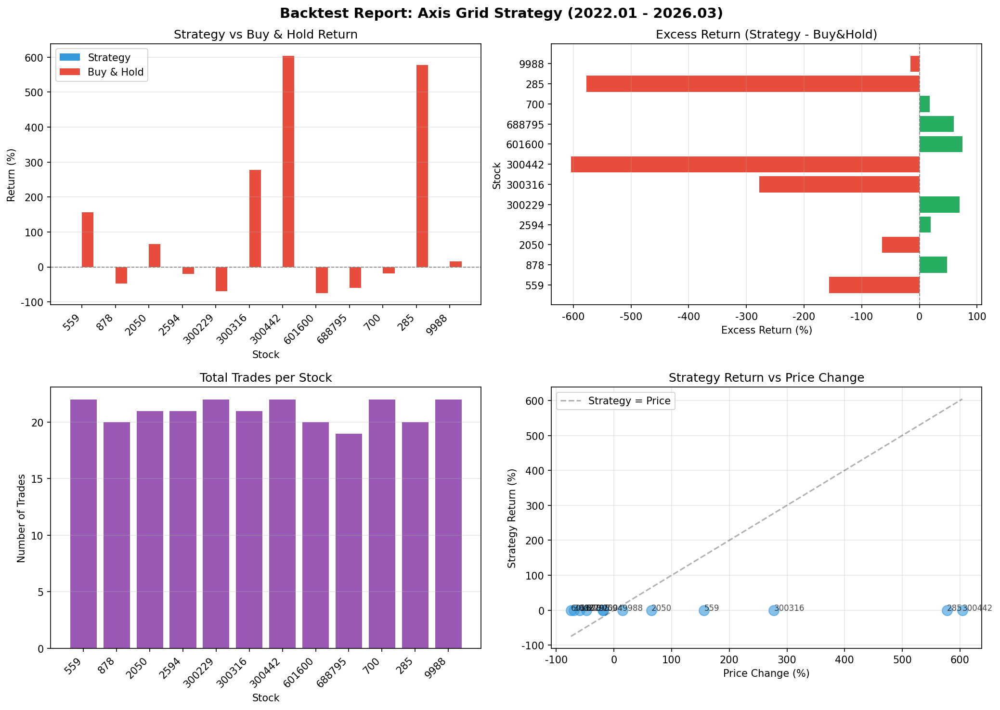

# 中轴价格仓位控制法回测报告

**回测周期**: 2022.01 - 2026.03 (4年2个月)  
**策略规则**:
- 单股上限: A股50万 / 港股150万
- 仓位分配: 50%底仓(长期持有) + 50%浮仓(网格交易)
- 买入: 偏离中轴-8%买入浮仓20%，-16%再买20%
- 卖出: 偏离+8%卖出浮仓20%，+16%再卖20%

## 汇总结果

| 股票 | 市场 | 股价涨跌 | 策略收益 | 买入持有 | 超额收益 | 交易次数 |
|------|------|----------|----------|----------|----------|----------|
| 559 万向钱潮 | A股 | 156.2% | -0.0% | 156.2% | -156.2% | 22 |
| 878 云南铜业 | A股 | -47.9% | 0.0% | -47.9% | +47.9% | 20 |
| 2050 三花智控 | A股 | 64.8% | 0.0% | 64.8% | -64.8% | 21 |
| 2594 比亚迪 | A股 | -19.4% | -0.0% | -19.4% | +19.4% | 21 |
| 300229 拓尔思 | A股 | -69.4% | -0.0% | -69.4% | +69.4% | 22 |
| 300316 晶盛机电 | A股 | 277.4% | 0.0% | 277.4% | -277.4% | 21 |
| 300442 润泽科技 | A股 | 604.1% | 0.0% | 604.1% | -604.1% | 22 |
| 601600 中国铝业 | A股 | -74.5% | 0.0% | -74.5% | +74.5% | 20 |
| 688795 摩尔线程 | A股 | -59.5% | 0.0% | -59.5% | +59.5% | 19 |
| 700 腾讯控股 | 港股 | -18.4% | -0.3% | -18.4% | +18.1% | 22 |
| 285 比亚迪电子 | 港股 | 577.5% | 0.0% | 577.5% | -577.5% | 20 |
| 9988 阿里巴巴 | 港股 | 15.3% | 0.0% | 15.3% | -15.3% | 22 |

## 统计指标

| 指标 | 数值 |
|------|------|
| 回测股票数 | 12 |
| 平均策略收益 | -0.0% |
| 平均买入持有 | 117.2% |
| 平均超额收益 | -117.2% |
| 胜率(超额>0) | 6/12 (50%) |
| 最大超额收益 | 74.5% (601600) |
| 最小超额收益 | -604.1% (300442) |
| 平均交易次数 | 21.0 |

## 图表

## 结论

❌ **策略表现不佳**

- 平均超额收益 -117.2%，胜率 50%
- 策略未跑赢买入持有
- 建议重新评估策略参数或改用其他策略

---
*报告生成时间: 2026-04-04 15:18*
